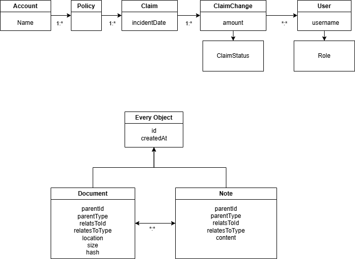

# Design Exercise

## Requirements Design
- Customer-submitted claims with supporting documents.
- Adjuster workflows to review, approve, deny, comment.
- Simple status and comms logs.
- Fraud detection (basic).
    - Dupe claims
    - Excessive Volume
- Secure file handling
- Audit trails
- Fraud pattern logging/detection
- Role-based access
- Traceability
- Integration ready with underwriting and payment systems

## Assumptions
- Enterprise scale
    - Low hundreds of simultaneous users.
    - Document uploads in the low tens per minute.
    - Concurrent access will be common and concurrent updates must be guarded against.
    - 24/7/365 support via Site Reliability Engineering or developers on call.
    - Availability in the 2-3 9s range.
    - Data durability and integrity at least 5 9s.
    - Graceful degradation under pressure is a concern.
    - Regulatory Compliance and auditing are a priority that need to be accommodated.
- Flexibility of choice
    - Known integration points are flexible enough to provide a free design space.
    - Existing corporate investments the same.
    - Team is eager to learn new languages, tools, etc. as appropriate.
    - Compliance can be achieved through many paths.
- Delivery timeline
    - This is a maximalist design with an appropriate level of effort.
    - To reduce scope several items can be cut:
        1. Cleanup jobs skipped for a few months of runtime.
        1. WAF left with default settings, other filters omitted.
        1. Batch actions and auditing microservice combined with claims into a miniservice.
        1. Audit logs limited to log4j output. Rely on the ClaimChange object for primary auditing.
        1. Remove kafka and all live integrations. Integrate via batch jobs only.
        1. Move all data stores to different shares of the same SAN with identical configuration (if compliant).
        1. Use database for user management, skipping AD, OAuth, etc. The cost:benefit ratio may not be particularly high.
        1. Skip non-essential fraud detection automation, use humans instead.
        1. Skip implementing the internally facing UI and provide a swagger. **NOT** recommended.

## Architectural Components
At a high level, this is a modified 3-level application design. It adds various filters (caching, AWF, etc.) as a further stage protecting the traditional 3.

### Filters
These components improve performance and security by filtering out traffic to the web services.
- Web Application Firewall (WAF)
    - AWS WAF, Cloudflare, etc.
    - DoS mitigation
    - Security monitoring and mitigation
    - SSL offloading
    - Compression Offloading
- Firewall
    - it's a firewall
- HTTP Caching Proxy
    - Squid, etc.
    - Offloading caching from the server
    - Including microservice to microservice calls

### Web Services
These are the components which will host the business logic and support integrations.
- Claims microservice 
    - Springboot
    - docker
    - running on k8s (or corporate standard).
    - REST API implementations (Create and Retrieve mostly).
    - Services the Claims object and children mainly.
- Event Stream 
    - Kafka, SNS, etc.
    - Push notifications to integrations, auditing, etc.
- Auditing microservice
    - Optional
    - Recieves push notifications and logs them.
    - Retrieves the log4j audit log if necessary.
    - More complicated fraud detection algorithms.
- Observability
    - Promethius
    - Incident detection/response
    - Hotspot detection
    - Cache Hit Rate
- Batch Actions
    - AWS Batch, k8s job, etc.
    - Bulk import from integrations that don't support webhooks.
        - Policy creation from underwriting.
        - Policy cancellation from payments.
    - Periodic cleanups

### Structured Database
Any flavor of SQL should be fine, backed by a durable data store. Wherever reasonable rows should be immutable for easy auditing. Dedicated cleanup methods can enforce relevant data retention regulations and compliance.

### Data Stores
- Durable Storage
    - ONTAP, Symmetrix, FSx, etc.
    - To store the database.
    - If object storage is not available, to store Documents.
- Object Storage
    - ONTAP S3, S3, etc.
    - Document storage, lifecycle automation, compliance, security
    - Offload document storage/retrieval resources from microservice
- WORM Storage
    - ONTAP, S3, etc.
    - Auditing destination with write-once guarantees from a third party.
    - Compliance audits will be easy.
    - I'm not sure how an object store would handle the many tiny writes per second. Investigation needed, sales engineering demo?
    - If not available, other storage could be used after confirming regulatory suitability.

## Database
### Domain Objects (Also DB Tables)
All objects have a creation time and ID. All can be commented upon or have relevant documents uploaded about them.
 - Account
 - Policy
    - Public ID
 - User
 - Role (Enum)
    - Customer
    - Adjuster
    - Payments
    - Underwriter
 - Claim
    - Due (Timestamp)
    - Status (from latest ClaimChange's ClaimStatus)
 - Document
    - File Location
    - Size
    - Hash
    - Content (base64 encoded, only loaded when needed)
    - Parent (with type and identifier)
    - RelatesTo (with type and identifier)(Same as Parent if Parent is not a Note or Document)
 - Note
    - Same as Document but no file location, Size or Hash.
    - Content
 - ClaimChange
    - ClaimStatus
    - Created Timestamp
    - User
    - Claim
 - ClaimSatus (Enum)
    - Created
    - Reviewable
    - Denied
    - Approved

 ### Object Relationships
 - 1 Account : Many Policies
 - 1 User : 1+ Accounts (A special All-accounts account will be used to signify a positive intent to give users global access)
 - Many User : 1 Role
 - 1 Policy : Many Claim
 - 1 User : Many ClaimChange
 - 1 Claim : Many ClaimChange
 - 1 Note or Document : 1 ClaimChange, Note, Document, User, Policy, Claim, or Account (parent)
 - 1 Note or Document : 1 ClaimChange, User, Policy, Claim, or Account (If parent is a Note or Document)

 ### Relationship Tables (in the DB)
 - UserAccountAccess

 ### Notable DB Indicies
 - Document and Note: (RelatesToIdentifier, RelatesToType) - for quick lookups
 - ClaimStatus (claim, createdAt, status) - for current status and fraud checks

 ## Auditing and Integrations
API calls will trigger configurable middleware in two rounds. The first round will use interceptors to implement a Chain of Responsibility (CoR) preceeding each request. This will mostly be for security, fraud, auditing, authentication, and authorization checks. The second round will be after the DB transaction is confirmed. That round will use an interceptor, Observer, or post-transaction hooks to notify interested parties of state changes.

### Interceptor CoR
In the chain of responsibility middleware is primarily aimed at security applications such as DoS mitigation. Each link will be isolated from the others for exception handling, but will be able to terminate the chain. The first link triggered will always be auditing. The next links security, then integrations and observability. The chain will be as early as feasible in HTTP processing to better scale when shedding load. 
The earliest link in the request CoR will be a log4j message which can be directed via configuration into a separate audit log on top of the routine debugging-oriented logs. Other interceptors can be used to integrate with specific auditing systems. This audit log can be configured to work with append-only filesystems, off-box filesystems (FSx), or other secure mechanisms.
User authentication and authorization can be changed by altering the CoR configuration to use Active Directory, OAuth, etc. in whichever combination is desired.

### Post Save CoR
After a non-idempotent REST call, a second chain of responsibility will be triggered. This is primarily to notify external stakeholders of state changes. Stakeholders such as auditing, payments, underwriting, email notifications to customers and others. Kafka or other event based systems is the preferred integration mechanism, but as a CoR, others can be supported.
The optimal spot in the call chain to maximize capability and value for the CoR is something I am not certain about. In a production environment I would discuss the matter with a spring SME before committing to that point.
If further reliability of message sending is needed the DB tables can have an extra column for messageSent, which is updated on successful completion of the second round. A batch job can be used to re-trigger missed rounds. The successful completion of the first round is implicit in the existence of the DB row.

### System Isolation
Additional safeguards against excess load can be triggered with speciality cases in the Chain of Responsibility for things like resource exhaustion. Second-order Chains of Responsibility (or Strategy wrappers) around integration links can handle timeouts, exponential backoff, etc. to protect the system against failing external integrations.

 ## Notes
 - Account, Policy, and User are mostly stub objects.
 - Notes on notes allows threaded communication.
 - Notes on User/Policy/Account is a very basic CRM. Proper integration can be achieved via import/export or by delegating the Note CRUD calls via CoR.
 - ClaimChange could be altered to be the entire auditing system, but that would complicate scaling. Better to keep it to major changes and handle detailed audits more properly.
 - Updates to ClaimStatus must include the id of the previous ClaimStatus in the request so that the DB transaction can be failed if a race condition occurs. If needed, each session can have a unique request ID (probably cookie) to handle race conditions and mitigate replay/DDoS attacks in a general way.
 - The full range of CRUD is not available to any object in this microservice. Row deletion is handled in dedicated cleanup functions only. Updates are limited to adapting to information from integrations with payments, underwriting, etc.
 - The headers tracestate, etag, stale-while-validate, and stale-while-error should be set per their respective RFCs.
 - Any API which does not specify a Role(s) which are acceptable MUST NOT run its business logic and SHOULD fail before any integrations in the CoR are triggered.
 - These choices represent an architecture for a large-scale actively managed web application. One for which the heavyweight nature of the many subsystems is worthwhile because the capabilities of each are utilized effectively. If a more startup/quick to create design is needed, only the application code (microservice), structured database, and durable storage are essential. The other services could be partially implemented with an extension of the Chain of Responsibility configuration, temporarily moved out of scope, or worked around.
 - Terraform for setup/configuration of the infrastructure.

## What is included
- Auditing via log4j, other CoR integrations, event monitoring integrations.
- Claim creation and status updating.
- Document upload and storage.
- Note creation.
- Notes and documents provided on nearly all objects (Account, Policy, User, Claim, Document, Note).
- Integration points for auditing, document upload/retrieval, user authentication and authorization, ticketing systems.

## What is omitted
- Account and Policy are stub objects, for other non-claim stories to flesh out.
- UI Design
- A structured workflow system with specific transitions, etc. Integration with Jira, a CRM, or similar will be more effective. A basic system with an AllowedTransitions table could be implemented.
- Customer access within their account is unlimited. I.e., no restricted/hidden policies.
- Explicit design of ways to offload document-related network traffic and resource costs.

## Scalability
I think that this architecture is capable of addressing the load assumptions given above, even if some of the time-saving scale reductions are implemented. With the traceability and caching headers we should manage to get acceptable hit rates on our caches. Lazy-loading of most large data sets will help as well. Bounding searches by date and pagination are further methods for improving scale at the database layer. Horizontal scaling is available via dockerized microservices, kafka consumers, k8s jobs, and even account-based sharding of the database. Securely offloading document upload/download from the microservice should remove a significant source of load. Even if the system is not hosted in the cloud otherwise, we may want to for document storage. As designed, this architecture should scale beyond the load levels I assumed.